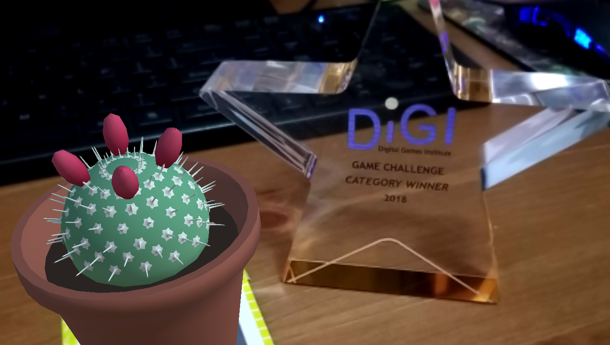
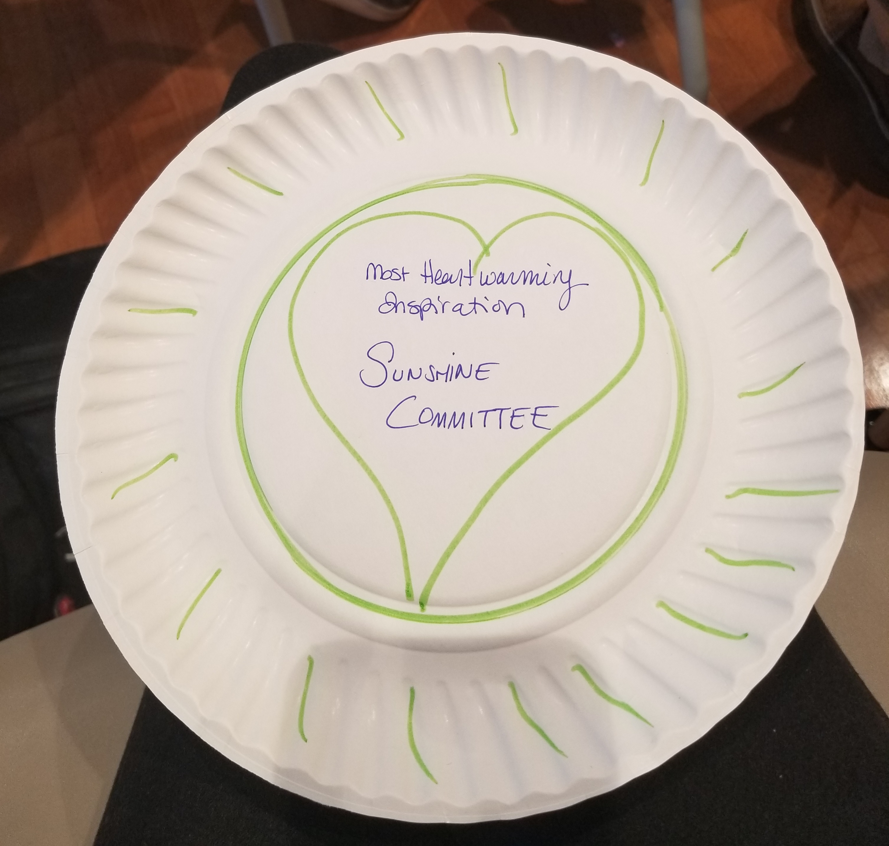

We did it.

<!--more-->

## Thank You

First and foremost, we can't thank you all enough for coming out and playing our demo this weekend. All the kind words and encouraging feedback made us swell up with pride. We have been preparing for this competition for the better part of a month, and we really feel like it paid off.

For those unfamiliar, the [Mass DiGI Game Challenge][massdigi] is a two-day event where people from around the New England area come to pitch their games to panels of industry professionals. Pitches include everything from project roadmaps, to target demographics, to monetization plans, as well as a live demo. Contestants enter in one of four categories: College Alpha, College Beta, Serious Games, and Indie. Today, we are proud to say we walked away as [the “Indie” category winners][winner].

But, that accomplishment and trophy pales in comparison to this extremely emotional award we were given by Jenny, the event coordinator.

## New Friends

The other best thing to happen to us at Mass DiGI this weekend was having the pleasure and honor of meeting the people at [Micropup Games][micropup] from Burlington, VT. Every single member of their team is a gleaming gem, and the game they're working on, "<i>[Keeper][keeper]</i>" is a marvel about the importance of respecting nature. We'd wholeheartedly recommend checking them out. They have a very, very good Mole character named Bonsai, so perhaps our meeting them was fate.


{{ mp }}

## What's Next

With this competition behind us, our next milestone is [Boston Festival of Indie Games][bfig] this coming autumn. Submissions for that event are now open, and close in about a month and a half. So, while we plan on taking the rest of the weekend to celebrate our win, we're going to get right back to the grindstone next week to start refining our vertical slice based on all the feedback we received. 

Once again, thank you all for believing in us and in our project. We hope to see you at BFIG 2018!

  

  <h3>Gallery</h3>
  
  {{ gallery }}

[massdigi]: https://www.massdigi.org/gamechallenge/
[winner]: https://www.massdigi.org/sip-blog/2018-massdigi-game-challenge-winners-3-3-18/
[micropup]: https://twitter.com/MicropupGames
[keeper]: https://vimeo.com/243470834 
[bfig]: https://www.bostonfig.com/