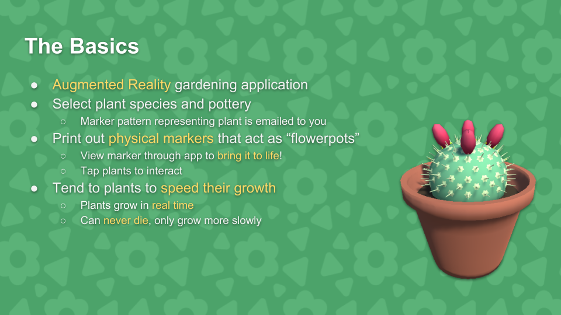

We're happy to say that [gARden][garden] made it through the first phase of [BostonFIG][fig] review process! We're one step closer to seeing you all at MIT this fall!

This first phase review was based entirely on a video submission about the game, so to celebrate, we thought it might be fun to break down the various pitches we've made so far and critique them a bit.

<!--more-->

## The First Pitch

This video was put together overnight as a submission application to the WPI Booth at PAX. The booth was student-run, and as such had a bit more of a relaxed set of criteria. Still, we wanted to keep our pitch as professional as we were able after only about two weeks of development. So, we produced the following video.

<iframe width="853" height="480" src="https://www.youtube.com/embed/wbtoKd5Ye2I" frameborder="0" allowfullscreen>
</iframe>

 

We figured that our biggest selling point was the novel technology (Augmented Reality), so we went for a cold open that cut right to the chase. After that, we cut back to the title screen and take it from the top, giving a vertical slice of what we had implemented at the time.

We also felt like it would be best to have a backing musical track for the video, for a couple of reasons. Primarily, having one just makes the video seem more professional and well-produced. Additionally, it helps mask any background or mouth noise that may have been picked up while recording with our not-studio-grade microphone. Huge shoutout to [Matt Martin][matt] for making a backing track for us basically overnight. 

One failing of the video, at least in my opinion, was its uneven pacing. Because the game was in such a degree of infancy, there wasn't a whole lot of game to show beyond the plant generation and rendering system. As a result, we kind of dawdled on certain screens more than we should have. This issue was only exacerbated by a lack of a script to control the tempo; we recorded the video first, and then I recorded voice back over it later.

While this video was pretty basic and had its shortcomings, we were ultimately rather pleased with it, so went on to [upload it to Twitter][tweet]. As of the time of this writing, it has achieved about 1500 views, which we think isn't half bad. One thing we learned is that Twitter uses the first frame of the video as a thumbnail. We made the mistake of doing a fade-in for this video, so sadly our Twitter thumbnail is just black.

### The Good
<ul>
  <li>Cold open to catch attention instantly</li>
  <li>Backing musical track to mask recording white noise</li>
</ul>

### The Bad
<ul>
  <li>Uneven pacing + no script</li>
  <li>Initial fade from black results in black thumbnail</li>
</ul>

## The Second Pitch

This pitch was constructed for the [Mass DiGI Game Challenge][massdigi], and as such was decidedly more business-oriented than the WPI booth submission, because Mass DiGI is more of a business-oriented program. The slides have been reproduced in the gallery below, and can be [downloaded here][slides] if you want to see the embedded video/GIF images. 

  <h3 id="gallery">Slides</h3>
  
  {{ gallery }}

The first and most important distinction here is that this pitch was presented live, in person, hence it being a slide deck instead of just another video. 

Still, we chose to open with a very abridged video that demonstrated the core concept of AR tracking. It is critical that you use a prerecorded video if you want to do something like this, because a live demo will ALWAYS fail you in your time of need. That's not a warning, that's a promise.

After the cold open, we summarized what the audience had seen in the video to reinforce the concepts in their minds. Key words and phrases were highlighted in yellow to make them stand out, and to assist with reader engagement. They were also useful as speaker notes to me as I was presenting, serving as reminders of what ideas to hit upon.

That being said, I also prepared formal speaker notes as well. Pitches at the competition were restricted to seven minutes, so unlike the pervious video, we had to make sure our content fit a very specific timebox. Preparing a script this time around helped produce a consistent pacing and made sure we had time to spare for questions at the end.

While we ended up [winning our category][massdigi], our presentation wasn't without faults. Unlike the overall competition winner, we neglected to do comparative analysis of competing games, nor did we have any real concrete analysis of our market. We knew that we wanted to target the most casual of gamers, and especially people who do not consider themselves gamers, but we did not explain what we already knew about that demographic.

We were also recommended to mark our development renders as such, because they do not reflect the quality of the game itself. On top of that, we were told that our use of GIFs to demonstrate things like growing or menu UX was distracting, because the movement on the slides draws more attention than the stationary speaker.

### The Good
<ul>
  <li>Cold open + prerecorded gameplay footage</li>
  <li>Key words and concepts highlighted</li>
  <li>Prepared speaker notes</li>
</ul>

### The Bad
<ul>
  <li>No competition/market analysis</li>
  <li>Low render quality + not marked as "IN DEVELOPMENT"</li>
  <li>Animated elements distract from speaker</li>
</ul>

## The Third Pitch

This final video is the one we submitted to [BostonFIG][fig]. When approaching this video, we felt that it should be similar to the one produced for the WPI booth several months prior, updated to reflect the improvements in the latest build of the game.

<iframe width="853" height="480" src="https://www.youtube.com/embed/ZHedpWteLO8" frameborder="0" allowfullscreen>
</iframe>

 

Unlike the WPI booth submission, BostonFIG presented a concrete set of criteria for us to build our video against:

<ul>
  <li>At least 30 seconds of gameplay that is unedited</li>
  <li>Added VO or text is fine, but no added music/FX/dialogue not in the game</li>
  <li>video must be 2-3 minutes maximum</li>
  <li>Tell us about your game, and why it fits the chosen category</li>
</ul>

These criteria helped us have a more consistent video structure, and helped with the pacing issue we faced with the first video. In addition, we  prepared a storyboarding spreadhseet, which outlined each core beat of the video, and how long that beat should be. I assembled the storyboard by rewatching the original pitch video, determining how long it would take for me to comfortably say what I was trying to convey the first time, and using that as the updated duration for the new video. I also used a script this time, which helped with verbal cadence.

Personally, I feel like the biggest shortcoming of this video is its requirement to be unedited footage. Ordinarily, that wouldn't be too much of an issue. However, because our game revolves around plants growing slowly in real time, it necessitated following a kind of awkward path through the game, in order for the plant to have enough time to visibly grow.

As a final note, the backing music was not in the original video due to the "no added music" restriction. I added it again for the upload here for the reasons I presented for inclusing it in the first video: to mask verbal downtime and undesired noise.

### The Good
<ul>
  <li>Storyboarded + scripted for better pacing</li>
  <li>Expanded set of features</li>
</ul>

### The Bad
<ul>
  <li>Unedited footage requirement forced us to wait for the plant to grow</li>
</ul>

## What's Next?

While we passed the first phase of review, the second phase is still on the horizon. We have a week to submit an updated build to the curators. Final decisions are disbursed in July, so we won't have much more to say about BostonFIG until then.

In the mean time, look forward to periodic updates about new features and additions to the game!

As always, thanks for reading.

[garden]: ../games/garden
[fig]: https://www.bostonfig.com/
[tweet]: https://twitter.com/FomTarro/status/954408572791742464
[massdigi]: ./2018-03-03-mass-digi
[slides]: ../assets/downloads/garden/massdigi_garden_pitch.pptx
[matt]: https://twitter.com/MattMatatt