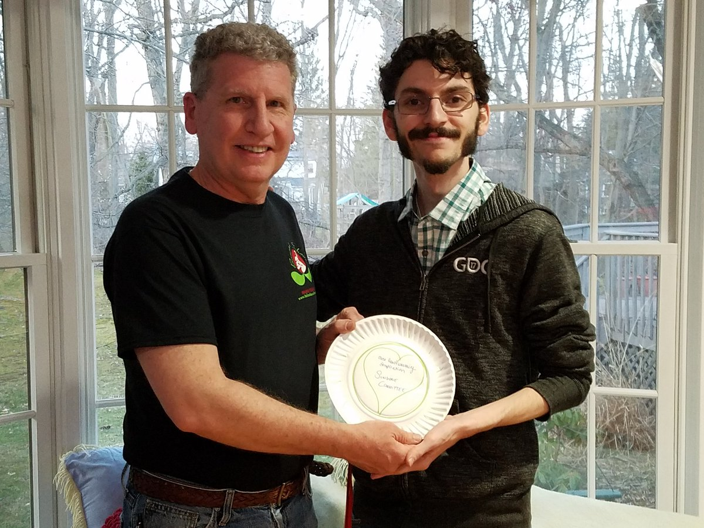
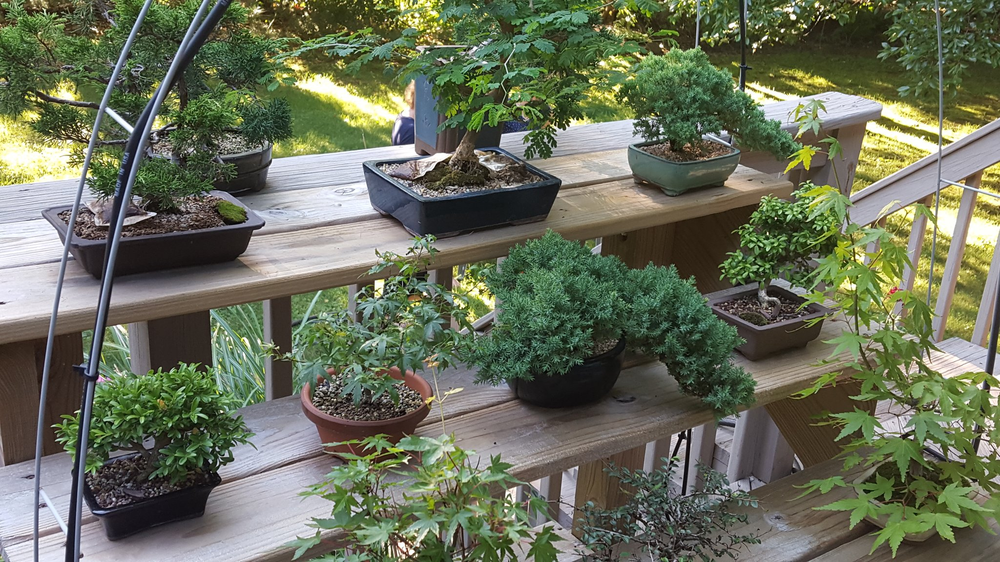

Back at the Mass DiGI Game Challenge, in addition to [winning our category](massdigi), we also won a much more personal award for "Most Heartwarming Inspiration." That inspiration is my dad.

<!--more-->

Specifically, [gARden](garden) draws heavy inspiration from my dad's recent commitment to bonsai as an art form and hobby (pictured above wearing a shirt from his bonsai club's local chapter). What started as one tree has since evolved into dozens, and I’m always glad to see them all encircling the house when I return home during the summer.

More importantly, though, I love hearing my dad talk about the latest seeds that he has planted, the newest plants he has traded for, and the plans he has for the season. I also love seeing the photo albums he has of every step along the planting process. 

When considering what we want [gARden](garden) to be, I think an important aspect is capturing that sense of excitement about something so chill, and distilling it down to a form which anybody could experience. Particularly, I’d like to share this experience with people without them also needing to invest quite as much money or time as my dad has.

So, thanks again, dad. I'm looking forward to seeing you and the trees again real soon.

[garden]: ../games/garden
[massdigi]: ./2018-03-03-mass-digi
