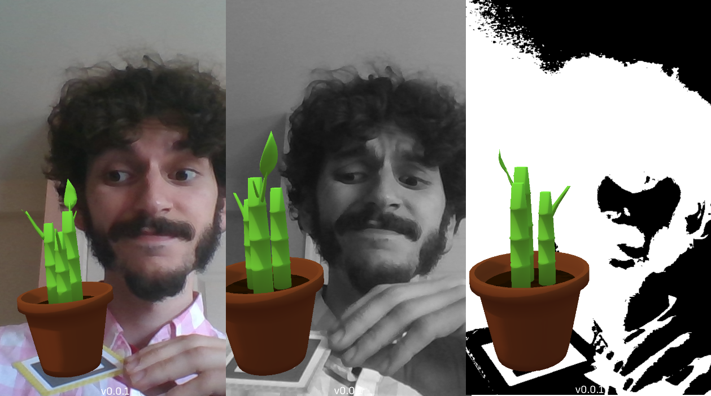

Ever wonder how Augmented Reality apps like [gARden][garden] know what they're looking at? Here's a peek behind the veil of Computer Vision.

<!--more-->

## What is Computer Vision?

Broadly, [Computer Vision][cv] (CV) is defined as "a field that deals with how computers can be made for gaining high-level understanding from digital images or videos". Naturally, it's the foundation of AR, which fundamentally hinges on interpreting reality (as presented via a stream of images) and augmenting those images in some intelligent way. 

AR is somewhat of a hot topic right now, and major mobile device moguls like Google and Apple offer their proprietary tool kits to work with their latest devices. These kits are great; they are extremely optimized for their company's latest hardware, and can produce amazing results. By that same token, however, building your app using such a kit locks you in to a very specific subset of target platforms. 

With [gARden][garden], we really want anyone to be able to enjoy the experience, and don't really need any super-powered graphical features. As such, we chose to homespin our own AR kit to reach the widest number of devices. 

## Image Processing

At the surface level, our app looks something like this:

But how does the computer know that it's looking at a marker? That's achieved through a process called feature extraction, wherein the computer examines neighboring pixels, and looks for a pattern that it has been trained to identify. This can mean patterns like the curvature of a face, or in our case, the square shape and inner arrangement of a marker.

But from just a raw camera image, there's too much going on to easily make any sense out of it. Specifically, color adds a level of variability that makes comparing pixels unreliable. So, our first step is to remove all color and convert out image in to greyscale, like so:

Once we've done this, we apply another technique known as Binary Thresholding. Simply put, thresholding is the process of assessing a pixel’s hue against a threshold value. If the value is below the threshold, the pixel is made to be pure white. If it’s above the threshold, it’s made to be pure black. Applying this, it’s much easier to see concrete shapes:

Once the computer has identified a candidate for a pattern match, it does some involved linear algebra to determine the perspective of the pattern, and applies that transformation to the corresponding plant.

## Performance Improvements

Of course, to construct those patterns, the computer needs to comb through every pixel and perform comparisons to its neighbors. As you might guess, this process scales poorly as image size increases. The Galaxy S8, for example, captures photos in a breathtaking 1440x2960 resolution. That's 4,262,400 pixels to search through and think about, every frame, at (ideally) 30 frames per second.

One common approach to help performance is to simply clamp the resolution of the camera to something small. In previous builds of the app, the viewport was a relatively small porthole on the screen. However, going forward we wanted the viewport to be the entire screen. Doing so would mean that low-resolution camera input would become more noticeable, as crisply rendered plants were superimposed on to an undesirably fuzzy backdrop.

The solution we came up with was to downscale the thresholded image to a fixed, manageable resolution. Our algorithm was then able to quickly determine the orientation of the plant in this smaller frame. Finally, we applied some more linear algebra based on the scale ratio between the downscaled image and the full-resolution image to translate the plant orientation to the larger frame. Magic. 

## Edge Cases

A unique problem of our marker-based approach is that we are very much at the whim of environmental lighting conditions. The aforementioned binary thresholding technique is good and fast, but completely fails if the lighting on the marker is so faint or so bright, that both the dark and light sections of the marker fall on the same side of the threshold. 

Initially, we considered using the device's ambient light sensor to adjust the threshold dynamically. But this still presents an issue in cases where the lighting conditions are uneven across the entire marker. While our human brains are good at telling us what looks light and what looks dark because we can look at the picture as a whole, from an objective standpoint each individual pixel is either light or dark to a computer.

With that thought in mind, we arrived at using a technique called Adaptive Thresholding. This type of thresholding determines local threshold values based on the minimum and maximum values of neighboring pixels in a radius around each individual pixel. Similar to feature extraction, this is expensive and scales poorly with image size. Fortunately, we had already implemented our downscaling solution which afforded us the computational capacity to pull this off.

On the left we have the same binary thresholding parameters that worked successfully in the above images, while on the right we employ adaptive thresholding. See the difference?

<table style="border: none;" border="0">
    <tr>
        <td style="border: none;">
            
        </td>
        <td style="border: none;">
            
        </td>
    </tr>
</table>

And that's that. Thank you for reading all the way to the end!

  

  <h3 id="gallery">Gallery</h3>
  
  {{ gallery }}

[garden]: ../games/garden
[cv]: https://en.wikipedia.org/wiki/Computer_vision
