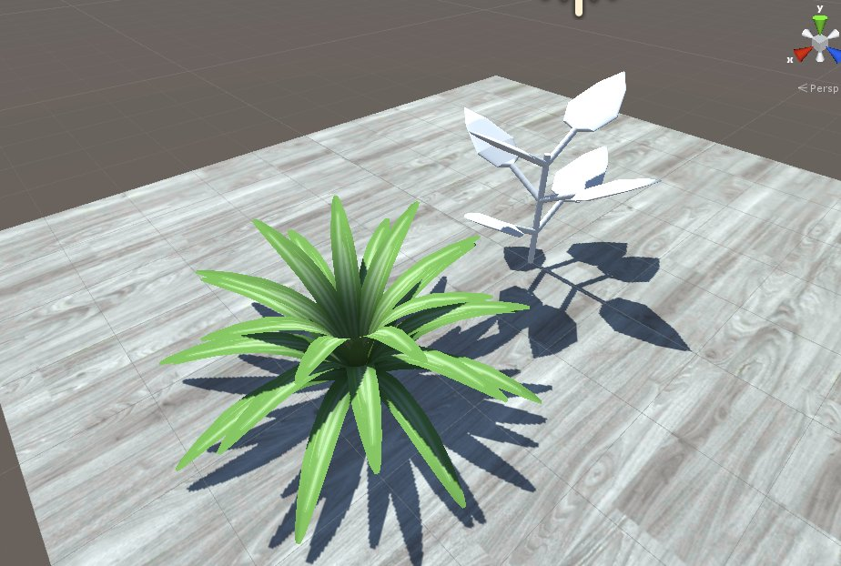
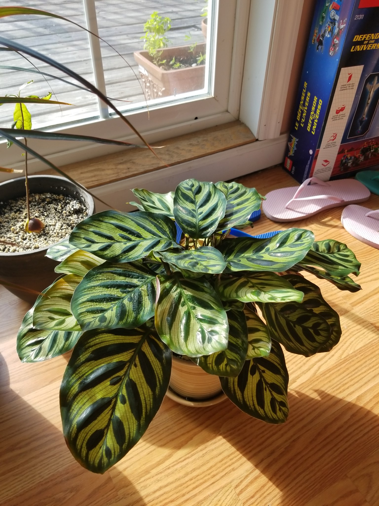
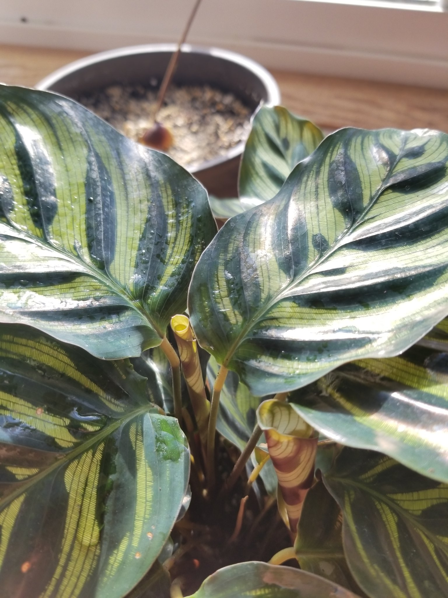
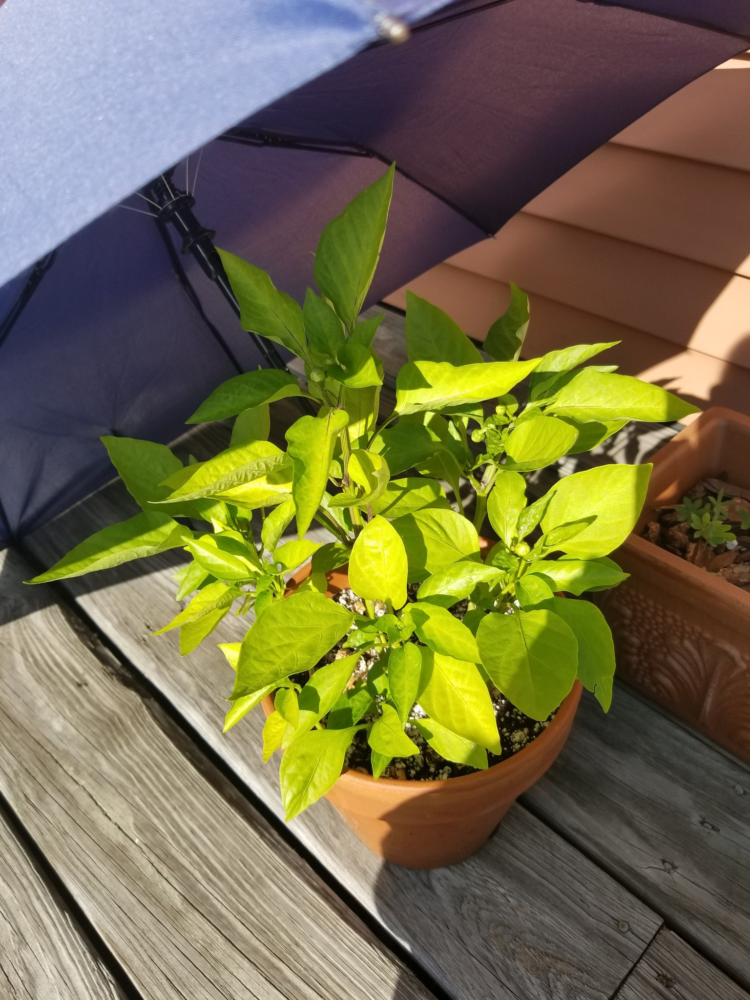
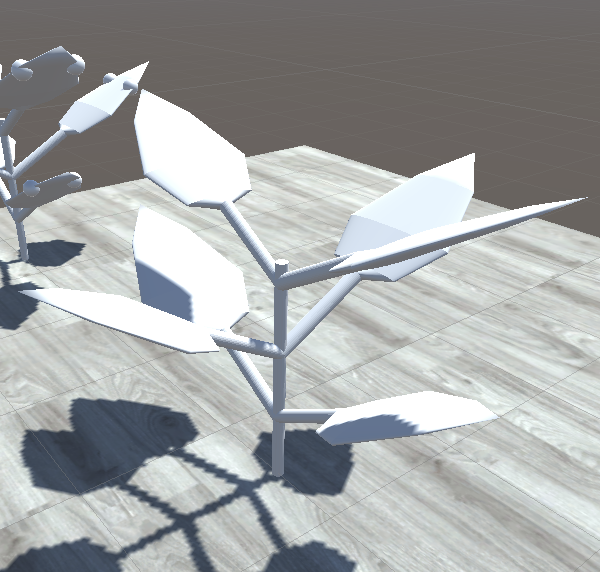

<!-- As August draws to a close, here's a roundup on the new procedural generation technique we've been working with over the past few months. -->

<!--more-->

## Growing Plants Previously

Previously in [gARden][garden], a plant's growth behavior was dictated using pre-built animations and/or blendshapes. While this method allowed for easy manipulation of plant growth over time, it lacked variability in how a plant could turn out based on player input. 

Additionaly, as we looked beyond succulent types, we realized we would need a system flexible enough to accomadate a menagerie of growth behaviors; flowering, fruit and seed production, unique branching and even leaf generation. Pruning and propagation are actions that also came to mind. 

Allowing players to groom their plant facilitates dynamic play, which would help keep them engaged for longer. For that to work, our plants need to be able to realistically pick a spot to regrow from and to have a plan on how they regrow. All of these are features that our previous system could only dream of accomplishing.

## Research

Since moving into our new apartment in June, we have added variety of plants to our collection. Observing the growth of plants over the course of two months provided a lot of insight on how differently plants respond to our actions and the environment around them. Notable ones have been our peacock plant, and pepper plants.

The peacock plant would spread its leaves upwards or downwards depending on how much light there is around them to receive the maximum amount of light. When growing a new set of leaves, it comes out of the soil as a rolled up tube, and slowly unfurls as it grows.
<table style="border: none;" border="0">
    <tr>
        <td style="border: none;">
            
        </td>
        <td style="border: none;">
            
        </td>
    </tr>
</table>

Our pepper plants were grown from seed, so it was very rewarding to see how its growth progressed over time. Upon pruning some of its leaves, we noticed it would slowly grow a new set at the nearest branching node in just a few days!
<table style="border: none;" border="0">
    <tr>
        <td style="border: none;">
            
        </td>
        <td style="border: none; width: 50%;">
            
        </td>
    </tr>
</table>

We also came across [The Algorithmic Beauty of Plants][abop] and it was an excellent jumping off point, introducing us to Lindenmayer Systems (L-Systems for short). The paper also gave us a solid understanding of implementing a turtle graphics system.

## Introducing L-Systems

[L-Systems][lsystems] is a type of generative system that uses formal grammar rules to build out strings. They're nice for generating fractals and plant-like patterns due their nature of expanding upon existing structures. We started with L-System examples from the paper. By writing out short sets of strings, we are able to generate a familiar plant.

### Turtle Graphics

To actually generate the plants in 3D space, we took inspiration from [The Algorithmic Beauty of Plants][abop] again and built a system loosely using attributes of [turtle graphics][turtlegfx]. We say loosely since our turtle isn't necessarily drawing out. Instead of drawing, the turtle travels along connected nodes and spawns plant components. With our string input, we command the metaphorical turtle in the system what type of component to spawn, at a specific angle in 3D space.

## Models & Rigs

With a proof of concept working, I started to test out how the system could deal with animations over time. To keep things simple, I modeled and rigged a spider plant leaf and added it to the system as a leaf component. 
A spider plant's growth is simple-- it continuously spawns new leaves from its center. It starts out straight and curves outwards over time to make room for newer leaves. 

For this spider plant test, I wrote a string that told the system to perform the following:
- S -> (Perform A)(Perform T)
- T -> (Perform B)(Perform C)(Perform D)(Perform T)
- A -> Spawn Root
- B -> Spawn Leaf from Root
- C -> Rotate around Root's Y axis 
- D -> Rotate around Root's Z axis

Which resulted in this:

As you can see, there's some clipping with the leaves, but hopefully that can be resolved by adjusting how to rig animates as the plant grows.

## Next Steps
 
As it stands now, our system can generate a plant and have it slowly grow overtime, randomly adjusting the rig at random intervals. This is moreso a prototype to see whether or not this method of generation would work for the features we wish to build out. 
The next steps for this system would be to further iterate on rig & blendshape manipulation, as well as adding in probabilistic variations for certain string commands.

Thanks for reading!

  

  <h3 id="gallery">Gallery</h3>
  
  {{ gallery }}

[garden]: ../games/garden
[abop]: http://algorithmicbotany.org/papers/#abop
[lsystems]: https://en.wikipedia.org/wiki/L-system
[turtlegfx]: https://en.wikipedia.org/wiki/Turtle_graphics