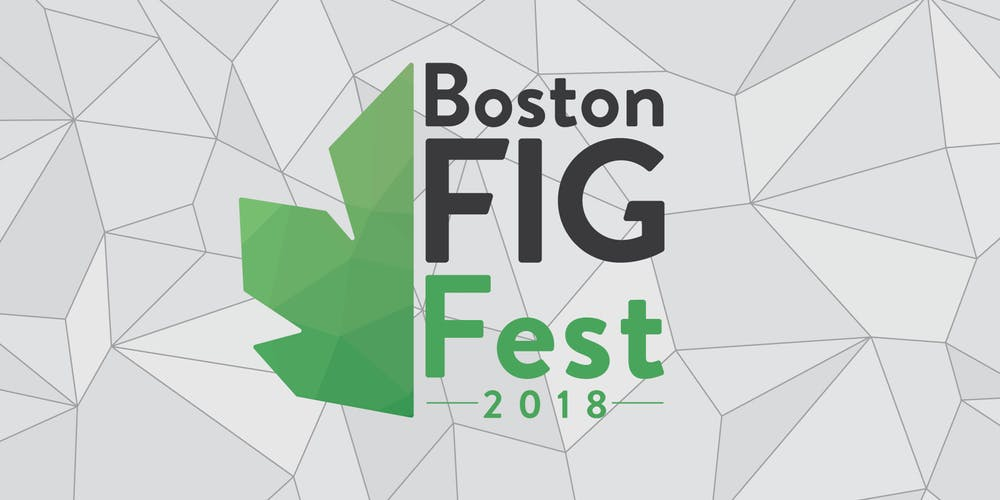
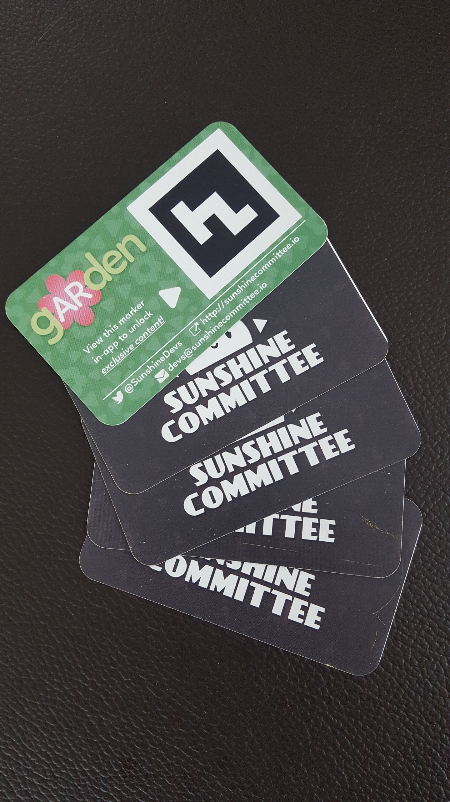
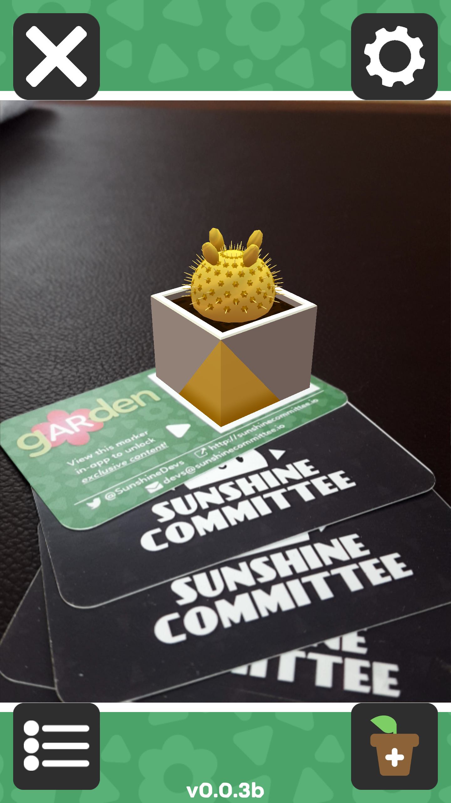

While we're not tabling at Boston FIG Fest this year as exhibitors, we will still be attending as visitors. If you're around and find us, come have a chat!

<!--more-->

We're happy to talk about IRL gardening, computer vision, procgen, the weather, whatever. If you want to meet up, give us a [ping on Twitter][contact] and we'll try our best to make it happen.

Of course, we'll also have a build of [gARden][garden] on us if you want to see it in action, and we'll be happy to give out our neato business cards.

<table style="border: none;" border="0">
    <tr>
        <td style="border: none;">
            
        </td>
        <td style="border: none;">
            
        </td>
    </tr>
</table>

[garden]: ../games/garden
[contact]: ../about/
