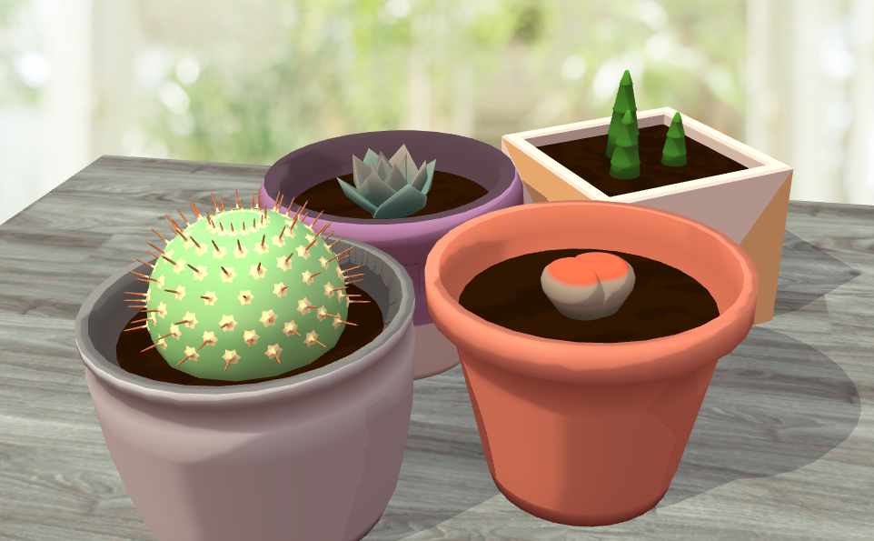
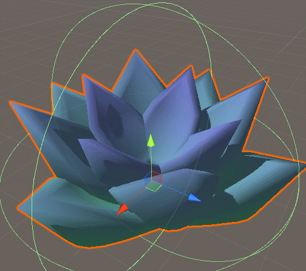
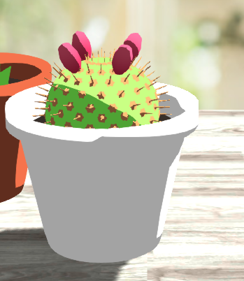
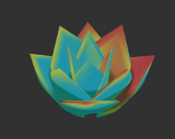
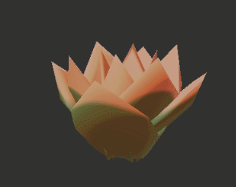
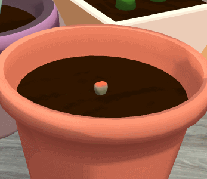

We've been hard at work improving upon gARden and taking the feedback received at MassDiGI to heart! Since then, artistic changes have been made.

<!--more-->

We received a lot of feedback on the artistic style of gARden. Many of which were concerning visuals. Chelsea's models are amazing, but it
doesn't do them much justice if they're rendered poorly!

Before jumping in, I would like to credit [Minion's Art][tutorials] for their wonderful shader and modeling tutorials. They were a huge help in figuring out
how to make our game look nice!

## Shader Development

Amongst the developers we spoke to at MassDiGI, it was very obvious to them that our models were using Unity's default method of shading. We decided
to tackle this first. Up until now, we had been using a simple shader that applied a color gradient along a designated axis, which left a lot to be desired.

Given the simplistic nature of our models, we wanted to pursue a toon/celshaded look over a hyper-realistic one. After all, Chelsea’s art style tends to work well with flat colors. But, that approach would look out of place in AR, so I ultimately had to find a happy medium between toon and realism. 

To start off, I extended our existing Plant shader to use celshading instead of the default Lambert shading.

While it was a good look, it was slightly too toon-y. The models lost a lot of definition as a result and were at odds with the rest of the environment in AR.
After several references and tutorials, I had a second iteration that featured softer shading and a toon ramp. 

The toon ramp gave us flexibility in how sharp we wanted the shadow's edges to be. We could also play around with what colors the shadows and highlights would be for each model.

<table style="border: none;" border="0">
    <tr>
        <td style="border: none;">
            
        </td>
        <td style="border: none;">
            
        </td>
    </tr>
</table>

## Lighting

Of course, shaders weren't the end all be all solution. Some of our models were reflecting the default skybox, which isn't great when they're supposed to be reflecting off of the AR environment.

After poking around with light settings, we managed to get something a lot nicer.

## Post-Processing

Now we're getting a bit extra. The intention behind post-processing for Since we're building to Android and iOS, this didn't work. The effects were simply too expensive to render on mobile devices, bogging down performance.

On the flipside, we got some really fancy renders on our test scene!

## Lithops Update

In celebration of our [real-life][toms] [lithops][kellys] growing their new pairs of leaves, I wanted to update our existing Lithops model with an actual growth cycle.

For the growth cycle, we wanted to emulate a lithops' two stages of growth: flowering and splitting. Unlike our other plants, lithops have a cyclical growth pattern, and needed to be implemented differently. Here's what we ended up with!

[tutorials]: https://www.patreon.com/minionsart/posts
[toms]: https://twitter.com/FomTarro/status/973405825946587136
[kellys]: https://twitter.com/chiffles_/status/969763013086588928