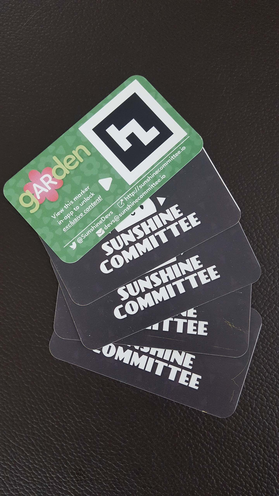

It's somewhat short notice, but [gARden][garden] will be demoing at the pre-PAX "Made in MA" party this year, thanks to Kelly! Details after the jump!

<!--more-->

## When and Where

The event is hosted by MassDiGI in District Hall on Thursday, April 5, 2018 from 6:00 PM to 11:00 PM! You can [RSVP and read the full details here][deets]. Students get in free with a promo code, which you can get by asking MassDiGI about it.

Kelly will be demoing [gARden][garden] as part of the WPI table. If you're around, please stop by and say hello! We've recently given our plants a fresh coat of paint, and want to hear what you think!

## Something Special

Also, if you stop by, be sure to grab one of our business cards for a special treat! You'll be glad you did once the app launches!

<table style="border: none;" border="0">
    <tr>
        <td style="border: none;">
            
        </td>
        <td style="border: none;">
            
        </td>
    </tr>
</table>

Our next major goal is to submit to the BFIG Digital Showcase, which closes on April 22nd. Hopefully, you can expect a few more development updates from us between here and there.

And, as always, thank you all for your support!

[garden]: ../games/garden.html
[deets]: https://twitter.com/mass_digi/status/980541456548007941
