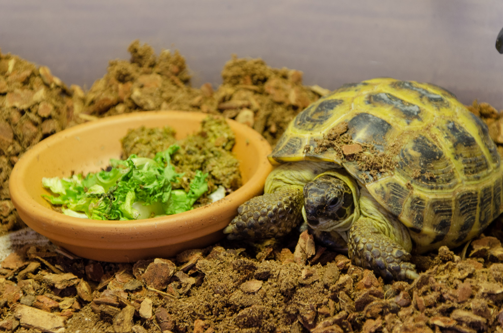

We went to Boston Playcrafting. Our friends got married. We got a tortoise!

Summer has been slow going for us, upsettingly enough. We've definitely wanted to get more done, faster. But we've been busy with some other things!

<!--more-->

Back in May, we exhibited at [Boston Playcrafting][playcraft], which was refreshing. It was the first time we had a hands-on demo for people in quite a while. Turnout was rather low, but it was pretty chill as a result.

Feedback was mostly positive! People found the concept novel, but there was some confusion surrounding the touch controls. So we've been working on both making them more intuitive, and also on implementing a non-intrusive tutorial. We're also working on a mascot character to help guide players. But more on them later, probably.

Then, this month, a whole lot of things happened back-to-back. I got promoted at my day job! Then, we flew across the country to Denver to attend a wedding, where we cried a lot. And in between those events, we adopted a tortoise!

## The Tortoise

This is Coco Jumbo. She's an Afghan tortoise of unknown age (we think a year or less). She weighs 0.76 pounds and is considered a little chubby for her size. Her favorite food is radicchio. We love her with all our hearts.

  <h3 id="gallery">Gallery</h3>
  
  {{ gallery }}

Tortoise husbandry has proved to be a unique and interesting challenge so far. Before we brought her home, we spent a week meticulously heating and monitoring an empty box of dirt, just to make sure we could provide an adequate environment for her. 

Maybe our next game will be about that.

Looking forward, our next event will (hopefully) be BFIG, and shortly before that, we will be attending [XOXO][xoxo] out west. So September is gonna be big for us, probably! See you there.

[garden]: ../games/garden
[playcraft]: ../articles/2019-05-03-playcraft-spring
[xoxo]: https://2019.xoxofest.com/
