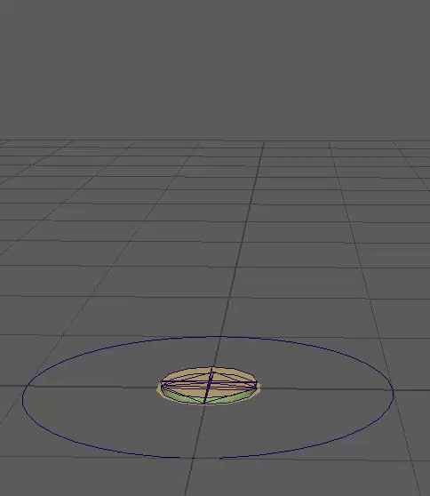
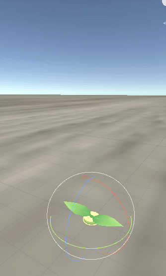

Please join us in welcoming Megan McAvoy aboard as an art collaborator for gARden!

<!--more-->

## Megan!!

Starting earlier this month, we signed Megan aboard as our resident 3D artist, freeing up Kelly's capacity to return to programming work.


{{ meg }}

We first met Megan at [massdigi][MassDiGI 2018], where she was a member of the winning team, Micropup. For that project, she did a ton of stylish 3D plant art for their game, Keeper. So her track record spoke for itself, and made signing her a no brainer. Currently she's getting up to speed with our animation pipeline, but she's already working on some wonderful bamboo assets.

Plus, here's a fun GIF of us totally goofing up our import settings.

## Future Plans

Despite exclusively positive feedback from curators, we were not chosen to showcase at Boston FIG 2019. That said, we opted to buy an exhibitor table, which we'll be sharing with another game called Vestigial, which is being worked on by Megan and her partner. I don't believe they have any social media or websites for that currently, but keep an eye out for it. From what I've seen thus far, it's really something special.

[garden]: ../games/garden
[massdigi]: ../articles/2018-03-03-mass-digi

