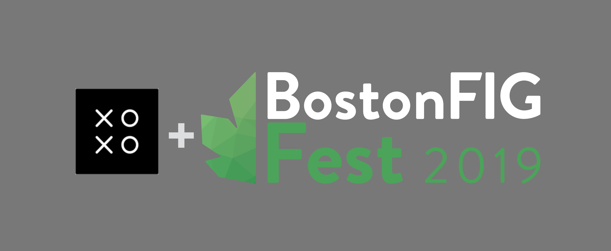

September is, as it turns out, quite busy for us! We'll be attending two events on opposite sides of the country, back-to-back this month.

<!--more-->

## XOXO

First up is [XOXOFest][xoxo], which is new to us. Kelly in partiuclar really wanted to go, so we're gonna see what it's all about. That's in Oregon from September 5th to the 9th! 
We will have a demo of [gARden][garden] on our person if you are there and want to try it.

## Boston Festival of Indie Games

The following weekend, on September 14th, we'll be tabling at [Boston Festival of Indie Games][bfig], sharing our space with Megan's other project, "Vestigial". 
We'll probably make a post indicating where we are on the map for that, once we know ourselves.

[garden]: ../games/garden
[massdigi]: ../articles/2018-03-03-mass-digi
[xoxo]: https://xoxofest.com/
[bfig]: https://www.bostonfig.com/

