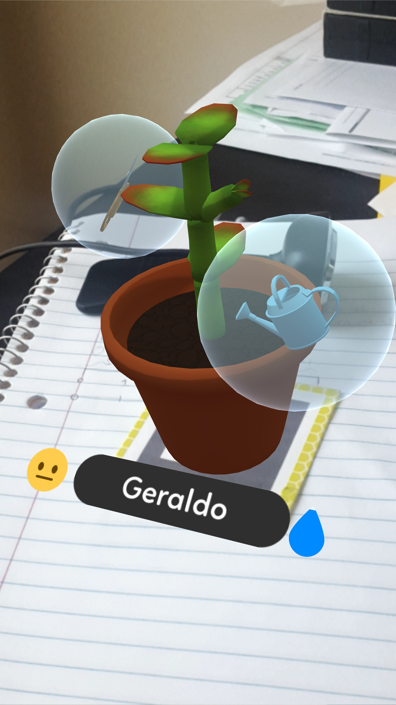

What have we been up to in the final quarter of the year? Quite a bit, actually!

<!--more-->

## What We've Done

All the way back in September, we shared a table at [Boston Festival of Indie Games][bfig] with out friends at Surreality. This proved to be a really invaluable experience 

### Meet Darcy!

One of our goals was to make the app as a whole a little less opaque to new users. To that end, we decided having a mascot/mentor character would be good. So, back in the Spring, we (Kelly) started drawing concepts for the palm tree that would become Darcy, the keeper of the nursery. You may have seen them if you stopped by our BFIG table, as they were on our banner!

My personal goal for Darcy is to write them as a bit of a high-strung nerd. Which, hopefully, should be easy, because that's what I am.

I'm not sure if we want to have other characters in addition to Darcy; we have a few concepts, but gARden isn't exactly the type of game that necessitates a large cast, so we'll see.

### More Intuitive UI

The singular complaint we heard again and again at BFIG was that the UI we built for interacting with the plant once you potted it was unclear. Our original approach was to try and lean in to the AR aspect and make the UI itself a 3D object that felt like it existed in world-space. 

To that end, we made little bubbles containting tools. The idea was that you'd tap and hold the bubble until it popped, and then use the tool following in-game instructions. However, we made several big oversights with this approach:

<ul>
    <li>The bubbles bobbed and orbited the plant, which made them somewhat difficult to get a finger on.</li>
    <li>Because they were 3D, the bubbles could sometimes be obscured by the plant itself.</li>
    <li>Knowing to tap and hold the buttons until they popped was not intuitive.</li>
    <li>Knowing what gesture to do after presented with the tool in the bubble was not intuitive.</li>
</ul>

So, we took another crack at it.

On the left, we have the old style of UI, featuring the 3D bubbles that orbited the plant. On the right, we have the new style of UI, which substitutes the bubbles for more traditional buttons that remain stationary relative to the screen, with tails pointing to the plant.

<table style="border: none;" border="0">
    <tr>
        <td style="border: none;">
            
        </td>
        <td style="border: none;">
            
        </td>
    </tr>
</table>

These new UI elements also look quite good in motion, if I do say so myself.

< VIDEO >

### More Plant Variance
 
## What We're Doing

[garden]: ../games/garden

[bfig]: https://www.bostonfig.com/

