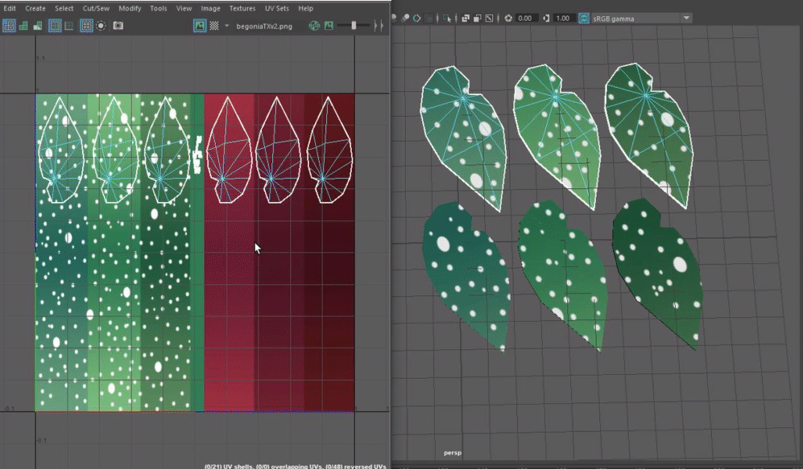
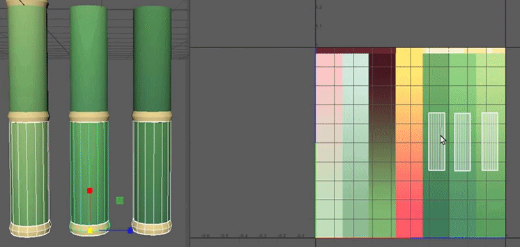

As alluded to in the last post, here's a step-by-step walkthrough of the evolution of our art pipeline!
<!--more-->
### Where We Started
 
Once we [contracted Megan to handle 3D art][contract] for us on her own time and schedule, it became apparent that we needed to set some guidelines about how assets should be constructed, so that she could work on them without needing constant feedback from us. To that end, we set out to create an internal "Art Bible".
 
We discussed how we wanted plants to have color variance within a species, and tried to figure out an effective way to do that without the color just being a random shift up or down from a base color. We wanted to be able to choose a bunch of colors in advance, and then somehow apply a little variation to the end result.
 
The first idea we came up with was having all our plants share a single texture that had a large number of pre-chosen color swatches on it. The plant generation system could choose from one of the color swatches at a macro level, and could then slide the plant's UVs up or down along the gradient to achieve the variance we desired on the micro level.
 

 
This plan seemed quite good for a moment. The approach of sharing a single texture was very filesize efficient, which is hugely important on mobile. For simple plants like the jade or bamboo that we had at the time, this solution was perfectly serviceable. However, Megan was ambitious and wanted to model the lovely begonia as our next addition. 
 
Begonias are not just a flat color; they have polka-dots! So, what to do?
 
Our first attempt for that was to simply repeat the same method, except with a unique texture for the begonia with added dots, rather than reusing the shared one.
 

 
We quickly realized that this was foolish. We lost the primary benefit of reducing file size, and created extra work for ourselves, needing to carefully reproduce the dot pattern for each color variation.
 
But what if we were able to combine the reusable gradient approach with the unique details approach? Now that’s an idea.
 
### Baby's First Shader
 
### Art Week!
Lastly, we were recently asked to prepare a small installation for [Boston's Art Week][artweek] this coming May. Details are sparse, but you can expect more tweets and blog posts as we get closer to the event. It's still almost half a year away!
 
[contract]: ../articles/2019-07-27-warm-welcomes
 
[artweek]: http://www.artweekma.org/
[garden]: ../games/garden
[bfig]: https://www.bostonfig.com/