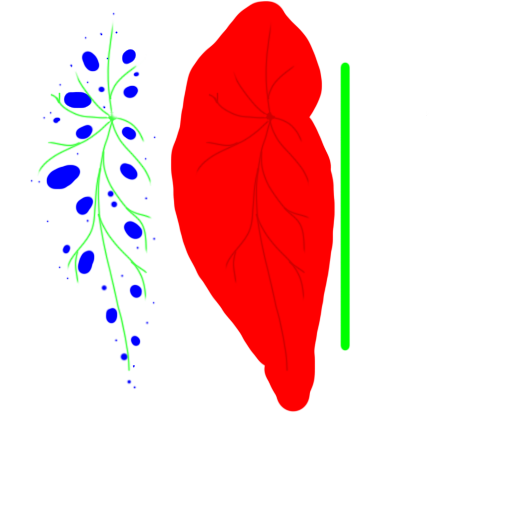

As alluded to in the last post, here's a step-by-step walkthrough of the evolution of our art pipeline!

<!--more-->
### Where We Started
 
Once we [contracted Megan to handle 3D art][contract] for us on her own time and schedule, it became apparent that we needed to set some guidelines about how assets should be constructed, so that she could work on them without needing constant feedback from us. To that end, we set out to create an internal "Art Bible".
 
We discussed how we wanted plants to have color variance within a species, and tried to figure out an effective way to do that without the color just being a random shift up or down from a base color. We wanted to be able to choose a bunch of colors in advance, and then somehow apply a little variation to the end result.
 
The first idea we came up with was having all our plants share a single texture that had a large number of pre-chosen color swatches on it. The plant generation system could choose from one of the color swatches at a macro level, and could then slide the plant's UVs up or down along the gradient to achieve the variance we desired on the micro level.
 

 
This plan seemed quite good for a moment. The approach of sharing a single texture was very filesize efficient, which is hugely important on mobile. For simple plants like the jade or bamboo that we had at the time, this solution was perfectly serviceable. However, Megan was ambitious and wanted to model the lovely begonia as our next addition. 
 
Begonias are not just a flat color; they have polka-dots! So, what to do?
 
Our first attempt for that was to simply repeat the same method, except with a unique texture for the begonia with added dots, rather than reusing the shared one.
 

 
We quickly realized that this was foolish. We lost the primary benefit of reducing file size, and created extra work for ourselves, needing to carefully reproduce the dot pattern for each color variation.
 
But what if we were able to combine the reusable gradient approach with the unique details approach? Now that’s an idea.
 
### Baby's First Shader

Our next approach was to try and once again use the shared gradient as a basis for the color, and then apply a secondary detail texture on top, as needed. To do that, I needed to write my first shader!

This ugly cube proved out the ability to scroll base texture UVs without impacting the overlaid detail, which would let us still achieve the UV-sliding variation we wanted, and would let us keep filesize relatively small.

But this still required us to have a master gradient texture full of every possible color transition for every plant we'd ever want to include. We'd need to go back and add to this shared texture every time we had a new color in mind. What if we could get more efficient? After all, these swatches are all just graidents. What if we could choose their colors in-engine, and reduce this master set of pre-colored gradients down to just one small gradient texture?

### Color Replacement

That's exactly what we did. After reading up on shader functions some more, we learned about the concept of color-replacement, which was exactly what we needed! We could have all plants share a single gradient that transitioned from black to white, and then simply make Unity Material assets which stored the colors that we wanted to replace each extreme with. 

Material assets are basically text files that record numeric values for things like color, or file paths to textures, and have a signifigantly smaller file size than graphical textures. As such, one small gradient texture with many resulting Material files is much more effieicent that just having one large gradient texture. Plus, it's a lot more flexible! A win-win.

Going a step further, we applied color-relacement to the detail overlay layer as well. For this one, instead of just black and white, we codified the idea that you could replace the Red, Blue and Green colors in the detail texture individually. 

As a result, we can thake these components...

<table style="border: none;" border="0">
    <tr>
        <td style="border: none;">
            
        </td>
        <td style="border: none; height: 256px;">
            
        </td>
    </tr>
</table>

...and combine them to do this in-engine!

These three sets of leaves all share the same two textures, thanks to this shader! We can freely add more colors at will, without needing to open up an art program. How nice.

### Art Week!
Lastly, as mentioned lastt time, we were recently asked to prepare a small installation for [Boston's Art Week][artweek] this coming May. Details are sparse, but you can expect more tweets and blog posts as we get closer to the event. It's still many months away!
 
[contract]: ../articles/2019-07-27-warm-welcomes
[artweek]: http://www.artweekma.org/
[garden]: ../games/garden