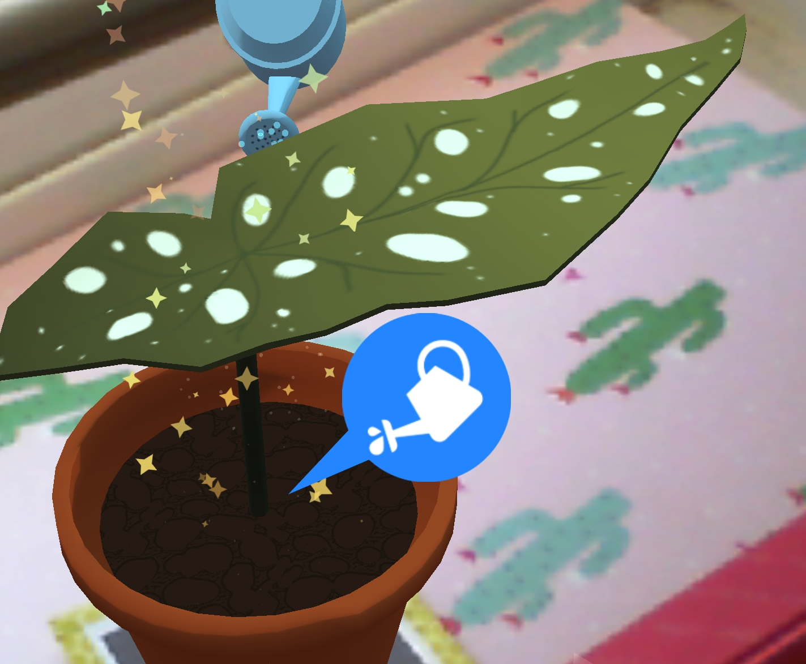

 
If you've been keeping up on your Sunshine Committee lore, you might recall that we mentioned [being scouted to do a week-long physical installation for Boston's Art Week][artweek] a few months ago. We've since avoided talking about it because it was presumed to be cancelled, and then *was* cancelled, due to the state of the world right now. But it's back! Albeit, in a much different form.
 
<!--more-->
## When, Where and How
Instead of a physical art installation (which we have to admit seemed like a perfect fit for [gARden][garden]), we'll be "tabling" at a demo night hosted online by [Venture Cafe Cambridge][venture], on Thursday, May 7th from 5-8 PM EST!
 
We'll be showing off gARden in its current state, and will be happy to talk about our plans for it, about AR/Computer Vision in general, about our real-world garden, and most of all, about our pet tortoise.
 
The event is open to all members of the public, and will be conducted through a teleconferencing platform called ["Remo"][remo]. From what we can tell, Remo is like a server for multiple concurrent teleconference meetings, with a UI designed like a floorplan. You can drag your avatar from one "table" to another to drop in and out of the various meetings. Just like visiting tables at a traditional expo event, except, you know, incredibly online.
 
You can join the Remo server from here, via the top bar which reads, "Click here to join the Virtual Café on Thursday at 3PM!":
 
[https://venturecafecambridge.org/][venture]
 
That said, the hosts have a virtual gathering every Thursday, so if you visit that above link more than one week out, you might accidentally visit a different event! Which is fine with them, or so we're told.
 
We hope to see you there!
 
[remo]: https://remo.co/
[venture]: https://venturecafecambridge.org/
[contract]: ../articles/2019-07-27-warm-welcomes
[artweek]: https://sunshinecommittee.io/articles/2020-01-24-texture-evolution#art-week
[garden]: ../games/garden

