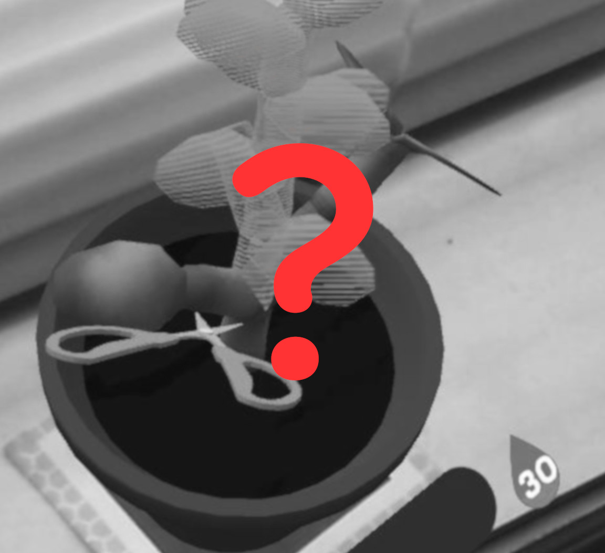
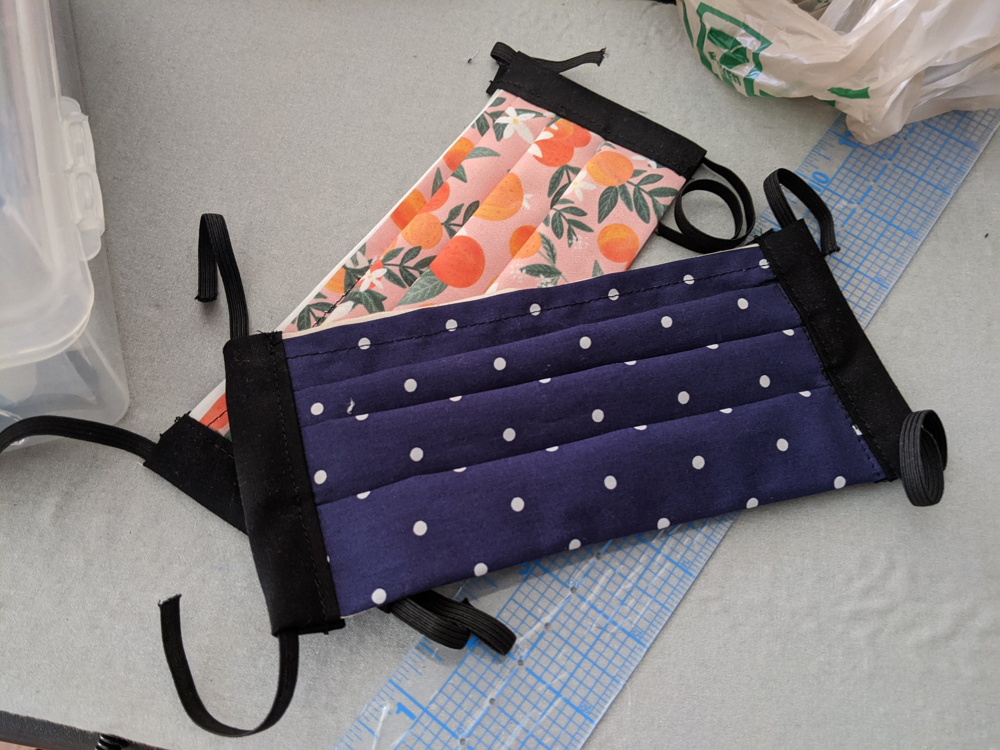
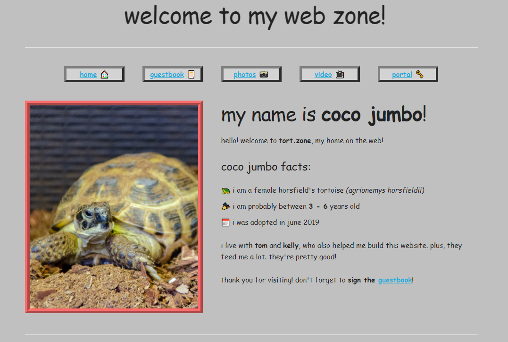

 
It's the middle of June already? Oh, bother. 
 
<!--more-->
## Where Has The Spring Gone?
 
Those of you who met us at Boston FIG back in 2019 may remember that we took sign-ups for folks interested in a closed testing phase for gARden, which we ideally wanted to begin dsitributing in early 2020. As you can see, we have fallen short of that goal.
 
### Masks
 
At the start of March, when concerns about a pandemic started rising, Kelly and I spent a lot of our time after our day jobs making reusable cloth masks for folks in our families and our community. 

Since then, we've probably made close to 60 masks! Unfortunately, this ate up pretty much all of our available time in the evening, and really put a strain on our ability to do app development. 

That said, we don't regret doing it at all, even though it set us back from our original timeline. Nothing is more important than public health and safety. 
 

 
### Boston FIG 
 
Still, with what limited time we had left over we were also hustling to prepare gARden for submission to Boston FIG 2020, which was supposed to happen in September of this year. 

Our artists worked hard to introduce a few more varieties of plants such as the Stargazer lily, and Kelly and I worked on adding improved gamification features like daily quests, in the same style as Nook Miles (Animal Crossing has just come out). We pushed and pushed and ultimately got a video put together for submission!
 

<iframe width="853" height="480" src="https://www.youtube.com/embed/niH6dW8HKI4" frameborder="0" allowfullscreen>
</iframe>

 
 
Then, two days after we submitted the video, the event was announced to be cancelled. This really sucked the wind out of our sails, and we felt kind of burnt out. Boston FIG was the last live event we had planned for the year, and now it, too, was cancelled. 

Of course, this was probably the correct call by the organizers; the US seems to have basically given up on fighting the coronavirus and I have no reason to believe things will be better here by September. Still, it was disheartening. We opted to take some time off and defragment out brains.
 
### tort.zone
 
Around this time, the first anniversary of us adopting our tortoise, Coco, was approaching, so we thought that working on a small side project for her would be a fun way to unwind. The scope was small enough that we could finish it in under a month, even on top of making masks and our day jobs. 

And so, last week, we launched [tort.zone][tort], Coco's personal website. I might actually do a post-mortem of that here later, if time somehow allows it. It uses some cool and fun web-tech, as well as some good old fashioned electrical engineering for the webcam component.
 

 
## What's Left?
 
That all brings us to today. What is left for gARden before we're ready to distribute for a closed round of testing? 

Honestly, at this point, we're thinking not much. Core features are all there: dynamic, procedural growth patterns, the ability to water, prune and repot the plants, the ability to take and share photos, and now some light gamification features to reward players for doing their caretaking duties. 
 
This leaves two core areas left: increasing the amount of content (more plant species/pot types) and filing administrative paperwork (creating Apple developer accounts, deciding if/how we want to monetize). 

If we do opt to monetize, there are a lot of legal hoops we need to jump through just to publish anything at all, so we're carefully considering our options. And, of course, if we do go that route, nothing will be locked behind a paywall that can't be obtained through regular play, so worry not!
 
So, yeah. That's where our past three months have gone. Oh, on top of that, we're house-hunting too. Fun, right? I wish I could tell you something like "hopefully everything will settle down in the next few months and we'll be ready to go in no time", but that seems less and less likely as time progresses. Every day is a new disaster in 2020.
 
Stay safe, stay well. We miss seeing you all at live events.
 
[garden]: ../games/garden
[tort]: https://www.tort.zone
 
 

