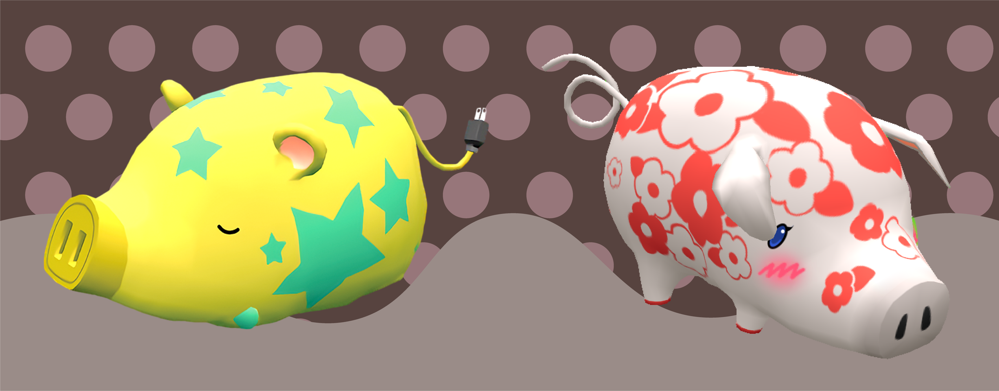

 

 
Here's a brief status report on Sunshine Committee's plans for Q1 2021 and beyond.
 
<!--more-->
## The Good News
 
The good news going into 2021 is that at the end of last year, we were approached with a request for collaboration by an experienced third party for an ongoing project. Naturally, we were flattered that someone was thinking of us.
 
This project is called [Tontachi][tontachi]. It's a pet simulation about raising a huge variety of different piglets, like those seen on the header image for this article. It has several highly appealing aspects that made us accept the request. For starters, it's spiritually similar to what we were working on for gARden, in that it's an AR virtual pet game. In fact, we were specifically scouted to help add a (relatively) lightweight plant-growing aspect to it, which is a type of system that we've become quite good at building by now. Secondly, this project has actual funding, several other members, and perhaps most importantly of all, a producer! These are all factors that will help us focus our efforts, keep us on track, and hopefully allow us to ship in a much more timely manner! We're pretty excited about the whole thing.
 
## The Bad News
 
The bad news is that, as a result, gARden development has to be suspended for the time being. Not because of any sort of non-compete or ownership transfer in our new contract, but rather that we simply don't have the time to juggle both projects at once. Though, to be frank, this isn't really much different than how things were going. Through the lack of expos and showcase events, we kind of lost sight of the finish line, and on top of that, both we and our collaborators were facing external factors that made working difficult. So gARden hasn't really progressed much since the last time we posted on here, anyway, as sad as that is to say. But, as previously mentioned, our contract in no way forbids us from returning to work on gARden in the future. So we hope we'll be able to do that again before long.
 
Overall, the news comes as a mixed bag; it's always bittersweet to have to put something on hold. That said, we're personally very excited to be able to apply our talents towards another novel project, especially one with clearer goals, deadlines and expectations. 
 
Thanks for sticking with us.

 
[tontachi]: https://urbanelectronicgames.com/tontachi/

