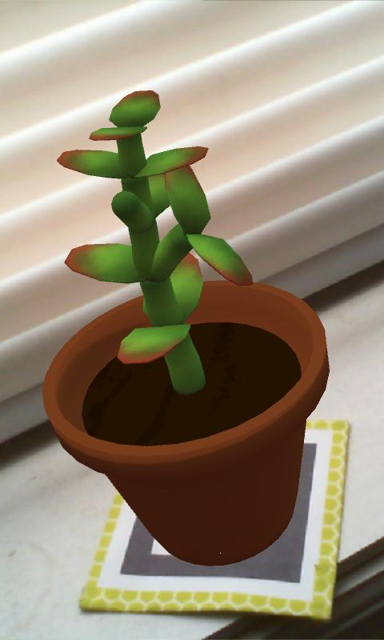

<iframe width="100%" height="315" src="https://www.youtube.com/embed/r6fwPkCOyX8" frameborder="0" allow="accelerometer; autoplay; encrypted-media; gyroscope; picture-in-picture" allowfullscreen></iframe>

We've been busy. In fact, our schedules finally aligned and we've made more forward progress in the past two months than we have in the past year. So time to fill everyone in. But why read a write-up when you can watch one instead?
<!--more-->

Okay, well, there's also stuff to read, too.

We wanted to submit to Boston Festival of Indie Games again this year, so we hustled and implemented some key features. At long last, we finally have the understanding and skills to bring [gARden][garden] much more closely in line with out original vision for the app. 

## Predictable, Generative Growth

One major feature was the ability for plants to actually grow in unique ways and feel alive. 

## Pruning

## 3D UI

[garden]: ../games/garden
[contact]: ../about/
